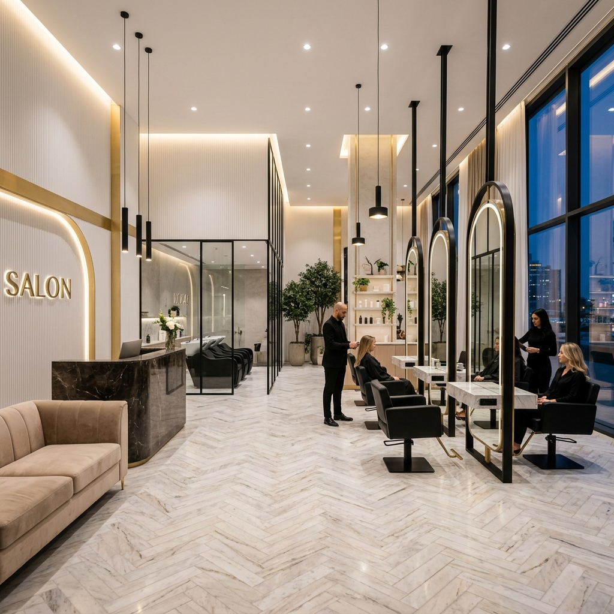

# ✨ Lumière | Luxury Hair & Beauty Care ✨

[](https://GenerativeZee.github.io/saloon-oppointment-booking/)
[](https://opensource.org/licenses/MIT)

A premium, high-end salon appointment booking system designed with a focus on luxury aesthetic and seamless user experience. Lumière offers a bespoke digital gateway for clients to explore services, meet master stylists, and book their next transformation in just a few clicks.

---

## 🌟 Key Features

- **💎 Luxury Design System**: Impeccable typography and a curated color palette reflecting a high-end brand identity.
- **📅 Interactive Booking Wizard**: A multi-step intuitive booking process (Service → Stylist → Date & Time).
- **🎨 Visual Excellence**: Cinematic hero section, smooth scroll animations, and a sleek image gallery.
- **📱 Fully Responsive**: Optimized for desktops, tablets, and smartphones for a premium experience on any device.
- **✨ Client Testimonials**: Dynamic carousel showcasing reviews from our satisfied guests.
- **✉️ Elite Newsletter**: Elegant subscription form for exclusive offers and updates.

---

## 🛠️ Technologies Used

- **HTML5**: Semantic structure for better SEO and accessibility.
- **Vanilla CSS3**: Custom styles with advanced CSS variables and animations.
- **JavaScript (ES6+)**: Custom-built booking engine and UI interactions (no external libraries needed).
- **Google Fonts**: *Playfair Display* for elegance and *Inter* for modern readability.

---

## 🚀 Installation & Local Development

1. **Clone the repository**:
   ```bash
   git clone https://github.com/GenerativeZee/saloon-oppointment-booking.git
   ```
2. **Navigate to the directory**:
   ```bash
   cd saloon-oppointment-booking
   ```
3. **Open the project**:
   Simply open `index.html` in your favorite web browser or use a live server extension in VS Code.

---

## 📸 Screenshots

| Hero Section | Booking Wizard |
| :--- | :--- |
|  |  |

---

## 📄 License

This project is licensed under the MIT License - see the [LICENSE](LICENSE) file for details.

---

## 🤝 Contact

**Lumière Luxury Salon**  
📍 123 Elegance Boulevard, Paris  
🌐 [Live Site](https://GenerativeZee.github.io/saloon-oppointment-booking/)

---
*Created with ❤️ for the ultimate luxury experience.*
